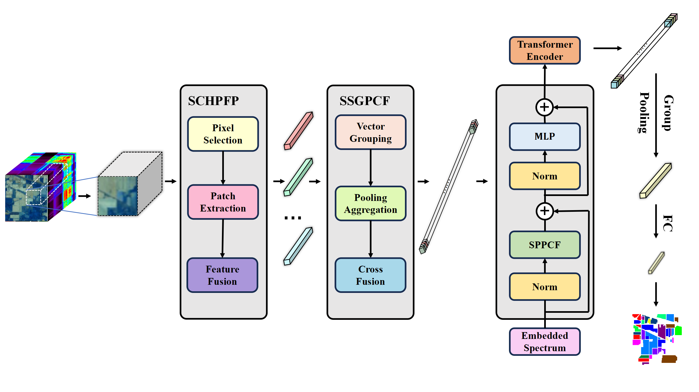
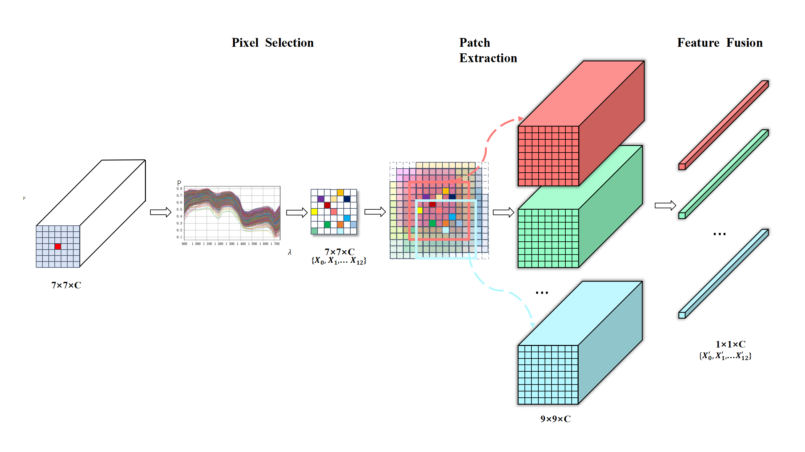
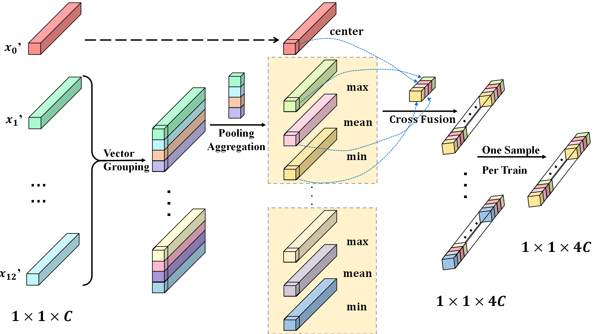

# ES2PFormer: Enhanced Spectral-Spatial Pooling
Yu Fang, Wenqi Dong, Yuting Sun, Xinyuan Gao, Xinwei Li
___________

**Figure 1: Overall block diagram of the ES2PFormer mode.**

**Figure 2: Flowchart of SCHPFP module.**

**Figure 3: Flowchart of the SSGPCF module.**

**Figure 4: Flowchart of the SPPCF module.**

Requirements
---------------------
    
    python==3.11
    numpy==1.26.3
    matplotlib==3.9.0
    scipy==1.13.1
    scikit-learn==1.5.0
    torch==2.3.1+cu121

Instructions
---------------------
    Functions.py ...... Script for data processing,calculating training loss,visualization and the parameter-free and training-free part of ESSPFormer(SCHPFP and SSGPCF).
    ESSPFormer.py ...... The implementation of SPPCF_encoder,the part of ESSPFormer with parameters to be trained.
    train_and_test_multi.py ...... Main script for hyperspectral image classification.

1. The results of Pixel Selection for all pixels in each dataset were saved in the "saved_corr_pos" folder after the first calculation. In the subsequent experiments, directly obtaining the Pixel Selection results through the coordinate index can avoid a large number of repetitive correlation calculations.

2. Pixel Selection and Patch Extraction use two patch sizes. The new central pixel brought by Pixel Selection will face insufficient padding and patch offset relative to the original image during Patch Extraction. oabi stands for overal bias and is a variable used to solve these problems.
