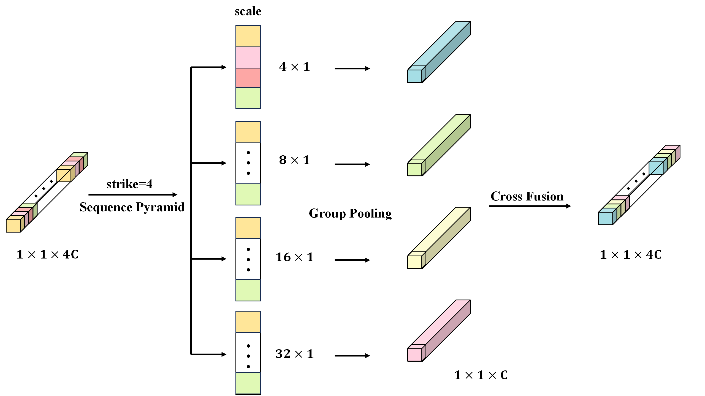

# ES2PFormer: Enhanced Spectral-Spatial Pooling
Yu Fang, Wenqi Dong, Yuting Sun, Xinyuan Gao, Xinwei Li
___________

**Figure 1: Overall block diagram of the ES2PFormer mode.**

**Figure 2: Flowchart of SCHPFP module.**

**Figure 3: Flowchart of the SSGPCF module.**

**Figure 4: Flowchart of the SPPCF module.**

Requirements
---------------------
    
    python==3.11
    numpy==1.26.3
    matplotlib==3.9.0
    scipy==1.13.1
    scikit-learn==1.5.0
    torch==2.3.1+cu121

Instructions
---------------------
